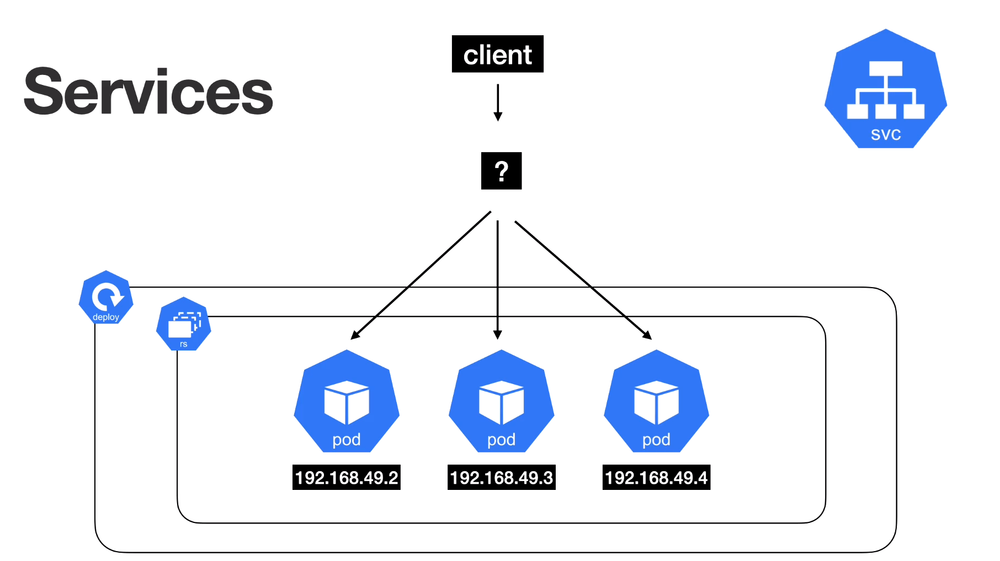
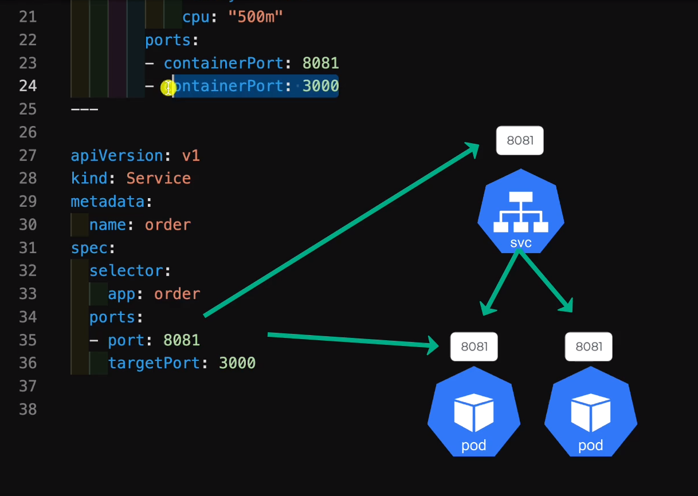
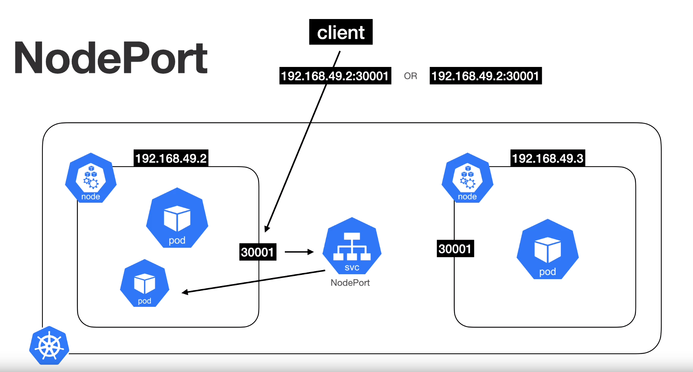
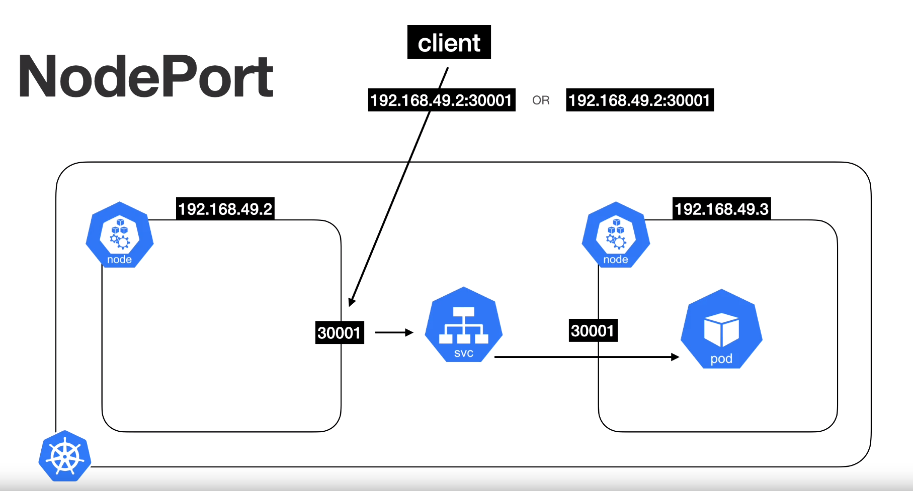
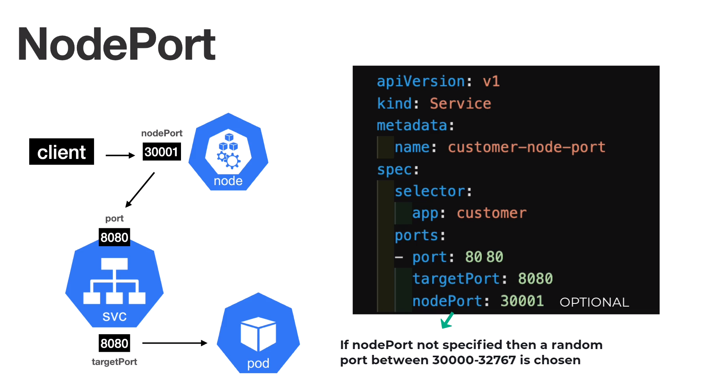

# Kubernetes Tutorial

##  Prerequisites
In order to work with kubernetes

- Docker 24.0.2
- Docker Desktop 4.21.0
- minikube 1.30.1

## Getting Started

### Kubernetes (k8s)

- Kubernetes means pilot in greek language
- written in **golang**
- Google product started with **Borg -> Omega -> Kubernetes**
- Deploys and manages applications (containers) **[Application Orchestrator]**
- scale up and down according demand
- Zero downtime deployments
- Rollbacks

### Cluster

- a cluster is a set of nodes **( Master node / Worker node)**
- Node **-->** VM or physical machine
- Master node is the brain of the Cluster
- Master node and Worker node communicate via the **Kubelet** 

</img>


### Master node

- Master node contains the control plane
- Master node runs all cluster's control plane services
- the brain where control and decisions are made


</img>

#### API Server (**api**)

- frontend to kubernetes Control plane
- All communications go through API Server **External** and **Internal**
- Exposes Restfull  API on **port 443**
- Authentication and Authorization checks 
- uses Kubectl client to communicate externally **kubectl apply -f**

#### Cluster store | state (**etcd**)

- stores configuration and the state of the entire cluster
- Distributed key value store
- Single source of truth (**Data base**)
- for documentation check this link : **https://etcd.io/**

#### Scheduler (**sched**)   

- monitoring new workloads/pods  and assigning them to a node based on several scheduling factors
- health checking
- resource checking 
- port availability checking
- Affinity and Non affinity rules

#### Controller manager (**c-m**)

- Daemon that manages the control loop (**Controller of controllers**)
  - Node controller
  - ReplicaSet
  - Endpoint
  - Namespace
  - Service Accounts
 

</img>


#### Cloud Controller manager (**c-c-m**)

- Responsible to interact with underlying cloud provider(**AWS-AZURE-GCP**) 
- Load balancers
- Storage
- Instances

### Example of creating a loadbalancer


</img>


### Worker Node

</img>


- VM or physical machine running linux
- provides running environment for our applications 


</img>


#### Kubelet

- Main agent that runs on every node
- receives pod definitions from API Server
- Interacts with container Runtime to run containers associated with the Pod
- Reports Node and Pod state to Master node

#### Container Runtime

- Responsible for pulling images from container registries (**DockerHuB - ECR - GCR - ACR**)
- Running containers and abstracting container management for kubernetes
- Container Runtime Interface  **(CRI)**  
  - Interface for 3rd party container runtime
  - **Containerd** (instead of docker that did become deprecated in kubernetes)

- for documentation check this link : **https://containerd.io/**

#### Kube Proxy

- Agent that runs on every node through a **DaemonSet**
- Responsible for 
  - Local Cluster networking
  - each node gets own unique IP Address
  - Routing network traffic to load balanced services

### Running Kubernetes 

- Running kubernetes ourselves ( **really hard** )
- using managed k8s
  - EKS - Elastic k8s Service
  - GKS - Google k8s Engine
  - AKS - Azure k8s
  - others

<ins>Managed kubernetes means that the Master node including its services are fully managed

for us and we just have to focus on the worker nodes and this where our applications do run</ins>


### Running Kube Cluster locally (**Creating a local cluster**)

- minikube
- kind
- docker


  - only used for leaning purposes
  - Local development CI
  - [**Important Note**](): Do not use it for any environment including production

### Docker

Check this link : https://docs.docker.com/get-started

```
docker version
```
### Minikube

minikube is a local kubernetes 

Check this link : https://minikube.sigs.k8s.io/docs/start/

```
minikube version
```
#### Starting the cluster 

```
minikube start
```
#### Checking status

```
minikube status
```
if minikube fails to start check this link : https://minikube.sigs.k8s.io/docs/drivers/

#### Checking ip address for Master node 

```
minikube ip
```


### Kubectl

kubectl will allow us to interact with our cluster from our machine 

- K8s Command line tool 
- Run commands gains our cluster (Deploy / Inspect / Edit Ressources / Debug / View Logs)

check this link : https://kubernetes.io/docs/tasks/tools/


#### checking Kubectl version


### Kubernetes hello world

```
docker run --rm -p 80:80 amigoscode/kubernetes:hello-world
```

##### Creating a pod with a container inside of it 

```
kubectl run hello-world --image=amigoscode/kubernetes:hello-world --port=80
```
##### display pods


##### Access the application within the pod

```
kubectl port-forward pod/hello-world 8080:80
```


##### deleting the pod
```
kubectl delete pod hello-world
```

### exploring the cluster

##### displaying nodes
```
kubectl get nodes
```

##### displaying all pods in all namespace

```
kubectl get pods -A
```


##### After creating hello-world pod


<ins>Note that we don't have Cloud-Controller-Manager because we are not running Kubernetes within AWS or Google cloud, we are running it within our machine</ins>

### SSH into Nodes

```
minikube ssh --node=Node_Name
minikube ssh --node=minikube
minikube ssh
```

##### Stopping the cluster

```
minikube stop
```

##### Fully deleting the cluster

```
minikube delete
```

### Cluster with 2 Nodes (1 Master Node + 1 Worker Node)

We intend to deploy everything on Worker Node

#### Creating a cluster with 2 Nodes 
```
minikube start --help
minikube start --nodes=2
```

#### Displaying Cluster pods / nodes

- Nodes => VM or Physical machines
- Pods => Containers

```
minikube status
kubectl get nodes 
kubectl get pods -A
```


#### Displaying ip addresses for Master node + Worker node
```
# Master Node (returns 192.168.49.2)
minikube ip

# Worker Node (returns 192.168.49.3)
minikube ip --node=minikube-m02
```

</img>

### Minikube logs

```
minikube logs

# '-f' flag is used for debbuging purposes to tail our log
minikube logs --node='minikube-m02' -f
```
### Pods

- Is the smallest deployable unit
- Group of 1 or more containers
- Shares network and volumes
- Never use pod on its own , always use controllers instead (ex: deployment)
- Ephemeral or disposable 

</img>


### Creating Pods

- **Imperative command** 
- **Declarative configuration**

</img>

</img>


#### Declarative vs Imperative

- **Imperative**
  - Learning
  - Troubleshooting
  - Experimenting "kubectl"

- **Declarative**
  - Reproducible
  - Best Practices


### Creating pods with Imperative command

```
kubectl run hello-world --image=amigoscode/kubernetes:hello-world --port=80
kubectl get pods
```
<ins>Note</ins>
In order to access the application tuning on the pod we can use port-forward, 
but it's mainly used for **testing purposes**

```
kubectl port-forward pod/hello-world  8080:80
```

### Creating pods with Declarative configuration

```
cd Desktop/Kube/yamls
kubectl apply -f pod.yml 
kubectl get pods
```

-f, --filename=[]:
The files that contain the configurations to apply (works on json or yaml files).


### Create and delete resources

Namespaces are a way to organize clusters into virtual sub-clusters

```
kubectl get namespaces
# or
kubectl get ns
```


```
cd Desktop/Kube/yamls
kubectl apply -f pod.yml 
kubectl get pods
kubectl delete -f pod.yml 
kubectl get pods
```

### List ressources

```
# list all ressources (default namespace)
kubectl get all

# list all ressources in all namespaces
kubectl get all -A
```


```
# getting all pods on kube-system namespace
kubectl get pod --namespace=kube-system
# or
kubectl get pod -n kube-system
```

### Describe a ressource

```
kubectl describe pod hello-world

# Short version
kubectl get pod hello-world -o wide

# To get pod definition
kubectl get pod hello-world -o yaml 
# or 
kubectl get pod hello-world -o json
```

### Debugging 

```
kubectl logs hello-world
# tailling the logs 
kubectl logs hello-world -f

# specify the container withing the pod name 

kubectl logs hello-world -c hello-world
kubectl logs Pod_Name -c Container_Name
```

### Shell access to a running pod

```
kubectl exec -it hello-world -- sh 
#or 
kubectl exec -it hello-world -- bash 
#or 
kubectl exec -it hello-world -c hello-world -- sh

kubectl exec hello-world ls
```

### Access Pod via port-forward

```
kubectl port-forward hello-world 8082:80
#or
kubectl port-forward pod/hello-world 8082:80
kubectl port-forward service/Service_Name 8081:80
```

### List all resources types + Cheat Sheet
```
kubectl api-resources
kubectl get no -o wide
kubectl --help
```

check this link : https://kubernetes.io/docs/reference/kubectl/cheatsheet

### Using Pods

- Never deploy pods using **kind:Pod**
- Pods are ephemeral ( expected to die / Short lifespan)
- Pods on their own don't self-heal

### Deployments

- Manages release of new application
- Zero downtime deployments
- Creating ReplicaSet

```
kubectl apply -f deployment.yml
kubectl get deployments
kubectl describe deployment hello-world

kubectl delete deployment hello-world
#or 
kubectl delete -f deployment.yml
```

### ReplicaSets

- Is a background control loop that ensures that the number of Pods are always present on the Cluster
- Like Pods never create ReplicaSets on their own always use Deployments
- If we want to delete a ReplicaSet we have to delete the Deployment instead of deleting the ReplicaSet

we add

**spec.replicas: 3**

to deployment.yml to **scale our Deployment Replicas**

```
kubectl apply -f deployment.yml 
kubectl port-forward deployment/hello-world 8081:80
```
- We should be using Services to access out applications instead of using Port-forward


```
kubectl get rs
kubectl describe rs hello-world
```


### Deployment and Rolling Updates

Live display of Pods

```
kubectl get pods -w
```

we change the configuration as below 


```
# Applying the updated config 

kubectl apply -f deployment.yml
kubectl get pods -w

# to check the new version  
kubectl port-forward deployment/hello-world 8081:80
```

<ins>Note that : the old replicaSet will still exist to facilitate rollbacks</ins>

</img>

#### Checking ReplicaSets

```
# should display 2 ReplicaSet

kubectl get rs 
```

#### Display history of changes of configuration

```
kubectl rollout history deployment hello-world
```


#### Rollback to a specific revision of configuration

```
# if we don't specify the revision it will go back to the previous one 

kubectl rollout undo deployment hello-world --to-revision=1
kubectl rollout history deployment hello-world
kubectl port-forward deployment/hello-world 8081:80
```


#### get more information about a specific revision

```
kubectl rollout history deployment hello-world --revision=4
```


### Managing our Cluster Using Declarative Approach


```
kubectl apply -f deployment.yml
kubectl get pods -w
kubectl port-forward deployment/hello-world 8081:80
kubectl rollout history deployment hello-world
```


**Note that : It's important to keep the declarative approche by using a Versioning system (Git) to track the configuration changes
instead of using ***kubernetes.io/change-cause*** to always be able to see the current state of our config**

### Revision history limit

by default kubernetes keeps only 10 version of rollout history elements,
we can override that by altering the property 
- Example:  **spec.revisionHistoryLimit : 25**

### Configure Deployment Rolling Strategy

- Recreate
- Rolling Update

**Rolling update** is the **better strategy** will **keep** the previous version running until the new version is running and fully  healthy
on the other hand **Recreate** will **delete** all the running pods before creating a new version of our application which results in **downtime**

- we can specify the maximum number of pods that can be unavailable in

**spec.strategy.rollingUpdate.maxUnavailable: 20%**


 
- we can also specify The maximum number of pods that can be scheduled above the desired number of pods.
**(never have more than 1 pod above the desired state)**

**spec.strategy.rollingUpdate.maxSurge: 20%**

#### Applying the Configuration 

```
kubectl apply -f deployment.yml
cd Desktop/Kubernetes/yamls/
kubectl rollout history deployment hello-world
kubectl rollout status deployment hello-world
kubectl get pods
kubectl port-forward deployment/hello-world 8080:80
``` 

### Pausing and Resuming Rollouts

``` 
kubectl rollout --help

#Example
kubectl rollout pause deployment hello-world
kubectl rollout resume deployment hello-world
``` 

## Services

- We should not use **port-forward** (Only for testing)
- We should never rely on Pod Ip Address because if we scale up or down , we will have new IPs
- We use Services to allow the client to communicate with our applications 

</img>


### Services 

- Stable IP address
- Stable DNS Name
- Stable Port

### Types of Services

- ClusterIp (Default)
- NodePort
- ExternalName
- LoadBalancer

We create our customer-deployment.yml

``` 
cd Desktop/Kubernetes/yamls/
kubectl apply -f customer-deployment.yml 
kubectl get pods
kubectl logs customer-5fb866577b-bxxrw
kubectl get all
``` 


``` 
kubectl port-forward deployment/customer 8080:8080
``` 

check this uri : http://localhost:8080/api/v1/customer

### Microservices Communication using POD IP Address 

``` 
kubectl get pods
kubectl describe pod order-787794b8c-lxrzb
``` 


After that we add the IP Address of the ORDER_SERVICE as an environment variable in the customer-deployment.yml in order to communicate with it

```
kubectl apply -f customer-deployment.yml
kubectl port-forward deployment/customer 8080:8080

``` 
check this uri :

- http://localhost:8080/api/v1/customer
- http://localhost:8080/api/v1/customer/1/orders


```
kubectl get pods
``` 


``` 
kubect describe pod order-787794b8c-h8vp7
kubect describe pod oorder-787794b8c-wq9zf


# We notice that pods have been deleted 
# and new ones have been created

kubectl get pods
kubectl port-forward deployment/customer 8080:8080
``` 


check this uri :

- http://localhost:8080/api/v1/customer/1/orders

we notice that the Customer Service can't communicate with the Order Service

because the IP Address of the ORDER_SERVICE has changed (different pod than the previous one)

**That resumes why we should never use POD IP Address and use Services instead**

### Cluster IP Service

- Default Kubernetes Service
- Only Internal access. No External


</img>

Cluster IP Service will send the traffic from the Customer Microservice to any Pod that is healthy of Order Microservice

We can send a request from the customer service to the order service using 

- **Service IP Address & Port**
- **DNS & Port**

we create the Order service with the order-deployment.yml file 

</img>

```
kubectl apply -f order-deployment.yml 
``` 
**Now from the Customer Microservice we need to point to the Order Service instead of the Pod Order**

```
kubectl get service
``` 


```
kubectl describe service/order
``` 


```
kubectl get endpoints
``` 


``` 
kubectl apply -f customer-deployment.yml

# To access the pod itself we need port-frowarding
# The ClusterIP is used for internal communication between Microservices
kubectl port-forward deployment/customer 8080:8080
``` 

check this uri :

- http://localhost:8080/api/v1/customer
- http://localhost:8080/api/v1/customer/1/orders


**Works Perfectly**

``` 
kubectl get pods 

kubectl delete pod order-787794b8c-h8vp7
kubectl delete pod order-787794b8c-wq9zf

# displays new order pods
kubectl get pods

kubectl port-forward deployment/customer 8080:8080
``` 
check this uri :

- http://localhost:8080/api/v1/customer
- http://localhost:8080/api/v1/customer/1/orders


- **Still Works Perfectly with Service IP Address unlike when we used Pod IP Address**

- **We can either use The Service Ip Address or the DNS of the  Service** 

### NodePort Service

- Allows us to open a port on all nodes
- Port range: **[30000 - 32767]**

``` 
kubectl get nodes -o wide
kubectl get pods -o wide
``` 


</img>

### The Service will always make sure to reroute the traffic to the healthy pods 

</img>

### Definition of NodePort Service in yml configuration file

</img>

#### Disadvantages of NodePort

- One Service per Port ( Later we will be seeing One Ingress and Multiple Services attached to it)
- If Node IP Address changes then we have a problem
- Cloud solutions like GKS & EKS offers scaling up and down so that if we lose a Node and new One is created


After adding the NodePort Service to the customer-deployment.yml

We Apply the updated Configuration
``` 
kubectl apply -f customer-deployment.yml 
``` 

``` 
kubectl describe svc customer-node
``` 


#### Accessing APi with NodePort Service


``` 
docker ps
kubectl get nodes -o wide
minikube ip
minikube ip -n minikube-m02
``` 


#### sending a request from minikube Node to minikube-m02 Node

``` 
minikube ssh
$ curl localhost:30000/api/v1/customer
$ curl 192.168.49.3:30000/api/v1/customer
``` 

#### SSH Access to minikube Node


#### SSH Access to minikube-m02 Node


``` 
minikube service customer-node --url
``` 


check this uri :

- http://127.0.0.1:36151/api/v1/customer


**Works Perfectly**

``` 
minikube service customer-node 
``` 


**Also Works Perfectly**


## TroubleShooting 

in case you get ImagePullBackoff 

check this video link : https://www.youtube.com/watch?v=1q7RLvwdkyo

### Kubernetes Plugin

to add a new template  check this image


